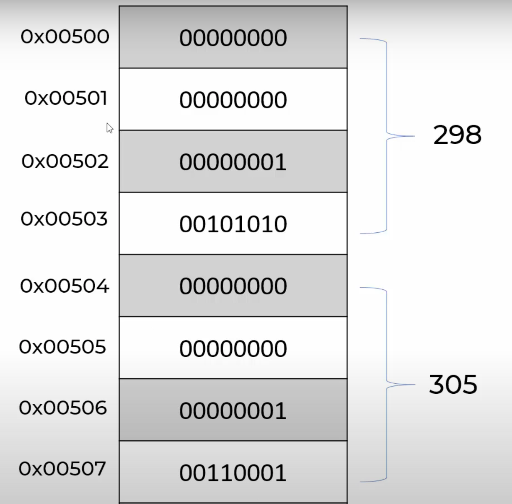

## Arrays
- RAM used to store data in arrays
    - memory locations have hexadecimal addresses
- Numbers convert to binary to store in memory location
- How integers stored in memory: <p align="center"></p>
---
- **BigO Analysis: Lookup by Index**
```python
stock_prices[0] -> 0x00500
stock_prices[2] -> 0x00500 + 2 * sizeof(integer)
stock_prices[2] -> 0x00500 + 2 * 4
stock_prices[2] -> 0x00508
```
- O(1)
    - Constant time operation looking up an element by index
---
- **BigO: Looking up by value**
```python
for i in range(len(stock_prices)):
    if stock_price[i] == 301:
        return i
```
- O(n)
    - Lookup by value
    - Order of n time complexity for n iterations
---
- **Array Traversal BigO Complexity: O(n)**
- **Array Insertion BigO Complexity: O(n)**
- **Array Deletion BigO Complexity: O(n)**
---
- Python: list is implemented as **dynamic** array
- Other languages (Java, C++), there are both **static** and dynamic arrays
- Statics Arrays
    - Cannot go beyond given array size
    - Only allocate memory for that fixed size
- Dynamic Arrays
    - Keep on adding elements
    - Do not need to specify length
    - Geometric Progression
        - how dynamic arrays handle memory allocation

