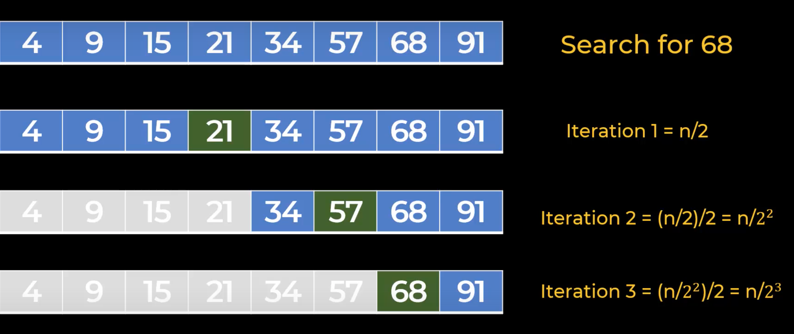

## Measuring Time Complexity
- **Big O notation** - used to measure how running time or space requirements for your program grow as input size grows
    - Used for all programming languages
- Notation Rules:
    1. Keep fastest growing term (time = a*n)
    2. Drop constants (time = 0(n))
- Reasoning behind Rules
    - BigO refers to very large value of n
    - If you have a function: time = 5*n^2 + 3*n + 20
        - **When the value of n is very large -> the second and third terms become irrelevant**
- **n refers to iterations**
    - number of computations
- Increasing size input -> time is almost constant
    - time = a
    - Keep fastest growing term
    - Drop constants (a) -> time = **0(1)**
        - Order of 1
- **Everything above also applies to Space Complexity**
- Example of Binary Search
    - Do not want to find number in a list using O(n)
    - If there are billion numbers then program has to do billion iterations 

- Binary Search (Search for 68 in a sorted list)
    - Find middle number in list and compare to 68 (less than so discard all items to the left)
    - Find middle number and see if less than and then discard left
    - Again divide array by 2 and take middle element is 68
        - Iteration 1 = n/2
        - Iteration 2 = (n/2)/2 = n/2^2
        - Iteration 3 = (n/2^2)/2 = n/2^3
    - Process to 3 iterations, while O(n) would take 7 since 68 in seventh position
    - Iteration k = n/2^k
- **Convert Iteration k = n/2^k to BigO**
    - 1 = n/2^k
        - 1 is best case scenario
    - n = 2^k
    - log2(n) = log2(2^k)
    - log2(n) = k
    - k = log n -> O(log n)
    - **Binary Search Time Complexity: O(log n)**
- Applying O(log n) to Binary Search example
    - k = O(log n) ->
    - **log2(8) -> 3 iterations**
        - 8 elements
## [Examples of Time Complexities and their Algorithms](https://towardsdatascience.com/understanding-time-complexity-with-python-examples-2bda6e8158a7)
## [Big O Cheat Sheet](https://bigocheatsheet.com)