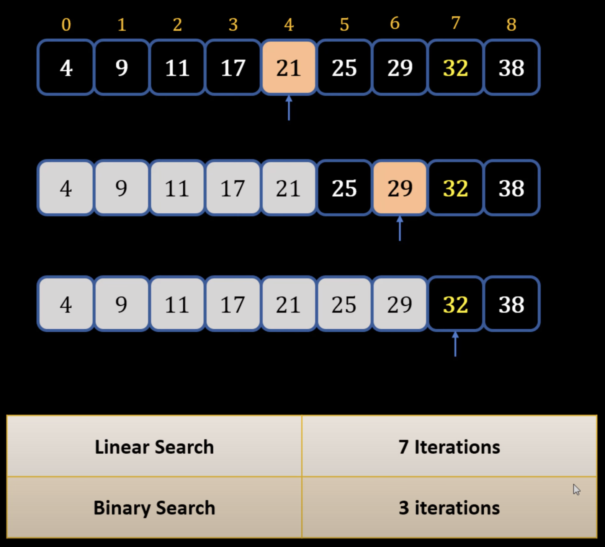

## Binary Search
---
### Linear Search Theory
- Iterating through a list to find an element 1 by 1 
- **Time Complexity: O(n)**
- Not very efficient with large amount of datasets
### Binary Search Theory
1) Take the middle element of dataset and compare to wanted value
2) Discard the half the elements that are less or greater than that middle element
3) Go to the middle of the half of the elements and compare to wanted value
4) Repeat step of 2 and after until wanted value found
- Example: 

- Dividing iterations in half
    - Iteration k = n/2^k
    - Solving n = 2^k gives Big O time complexity
- **Time Complexity for Binary Search: O(log n)**