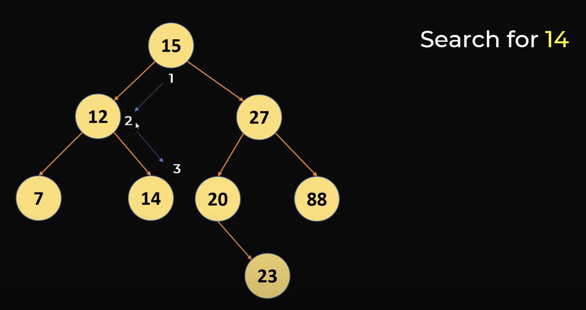
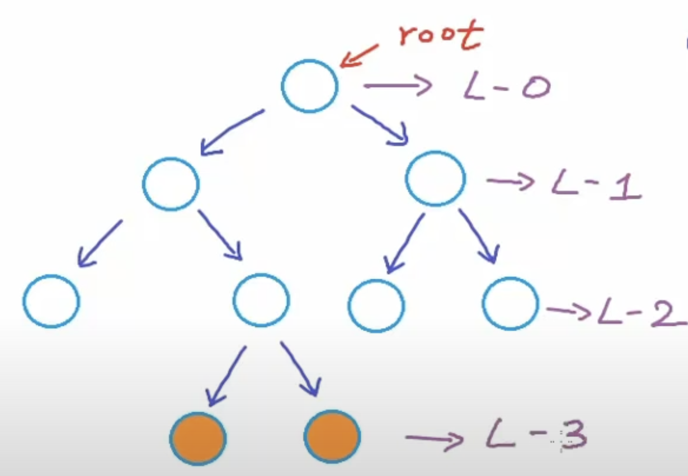
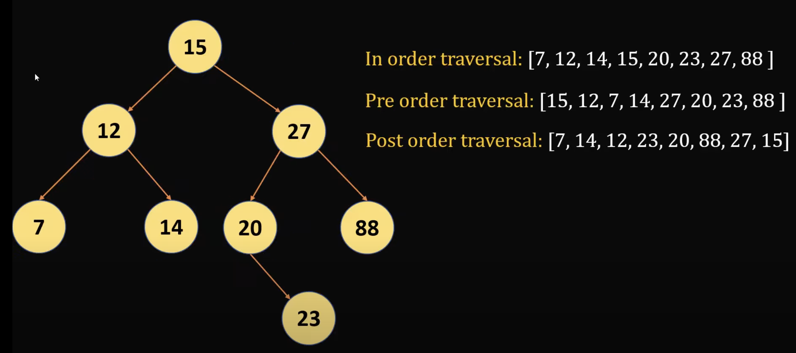

## Binary Tree  
---
### What is a Binary Tree?
- A general tree, but **every node has at most 2 child nodes**
- Binary Search Tree or BST
    - Special case of Binary Tree
    - Elements have an order
    - Elements are always unique
### Searching a BST
- Searching complexity in a list would be order of O(n)
- Searching with through a BST needs to be efficient
    - Searching for element 14: 

    - Do not need to search the right hand side of tree since 14 < 15
### Search Complexity
- Every iteration we reduce search space by 1/2
- n = 8: 8->4->2->1
    - Total number of nodes is 8
    - 3 iterations
    - log base 2 of 8 = 3
- **Search Complexity: O(log n)**
### Inserting an Element in BST
- Evaluate element against each node
- **Inserting Complexity: O(log n)**
### Terminology
- Root Node (First node at top)
- Levels: 

- Depth
    - Maximum depth of tree = height of tree
    - Number of edges (lines) from root to node -> depth of a node
- **Maximum number of nodes at level i = 2^i**
- Left Child and Right Child
    - Empty child means null
- Leaf Node - node with no child nodes
- Binary Tree -> only condition is that 1 node must have 2 children
    - Strict/Proper Binary Tree -> each node can have either 0 or 2 children
    - Complete Binary Tree 
        - -> all levels except possibly last level are filled
        - -> all nodes are as left as possible
        - **Height of Complete Binary Tree**
            - **floor(log2(n))**
    - Perfect Binary Tree
        - all levels are completely filled
        - depth is the number of edges from root to leaf node
        - **Maximum number of nodes in a binary tree with height *h***
            - **n = 2^(h+1) - 1**
        - **Number of nodes given a height *h***
            - **h = log2(n+1) - 1**
### Search Types (Traversal Techniques)

- **Breadth first search**
- **Depth first search**
    - **In Order Traversal**
        - Need the Root Node *in order*
        - **Order of traversal: Left subtree, root node, right subtree**
        - Apply recursive technique at each node
            - Go to left subtree -> Make current node the root node -> Go to left subtree
    - **Pre Order Traversal**
        - **Order of traversal: Root node subtree, left subtree, right subtree**
        - Apply recursive techniqeu at each node
    - **Post Order Traversal**
        - **Order of traversal: Left subtree, right subtree, root node**