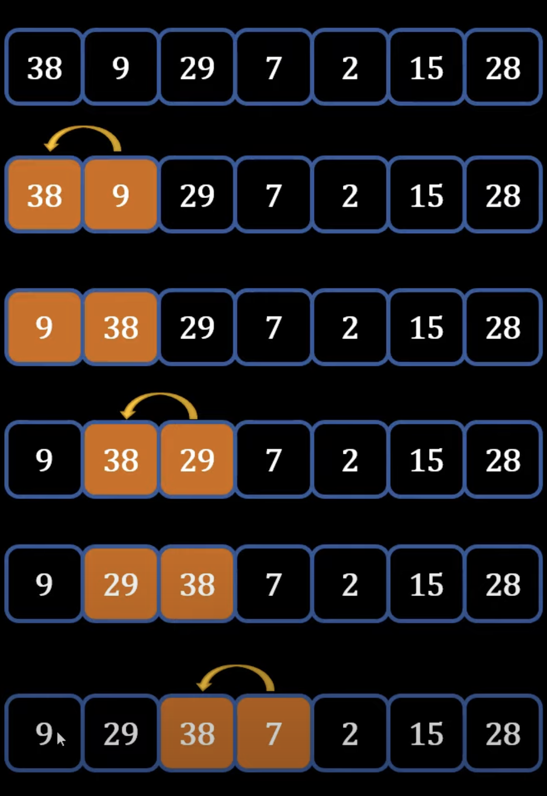

## Bubble Sort
---
### Theory - How Bubble Sort works
- Example: 

1) If first element in greater than second element -> swap
2) Compare second element with third -> swap if second greater
3) Keep repeating until the **highest number is at the end**
4) Repeat above steps again until entire dataset is sorted
- Summary
    - Highest number goes towards the end
    - Comparing side by side elements
- *Why it is called bubble sort:*
    - Like bubbles rise to the top, highest number goes to the correct position
### Tree Terms
- Has branches and leaves
- Top entity is called **Root Node**
- Intermediate elements are called **Nodes**
- Entities that do not have subcategories or children are called **Leaf Nodes**
- Categories can have Parent/Children, Ancestors/Descendants, and Level: 0,1,2
### General Tree Example: 

