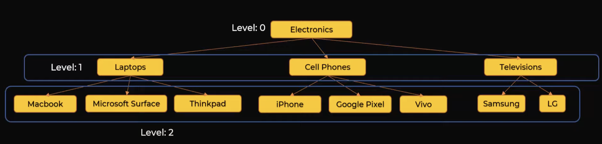

## General Tree
---
### Tree Structure Use-case
- Use whenever need to represent hierarchical information 
### Tree Terms
- Has branches and leaves
- Top entity is called **Root Node**
- Intermediate elements are called **Nodes**
- Entities that do not have subcategories or children are called **Leaf Nodes**
- Categories can have Parent/Children, Ancestors/Descendants, and Level: 0,1,2
### General Tree Example: 

