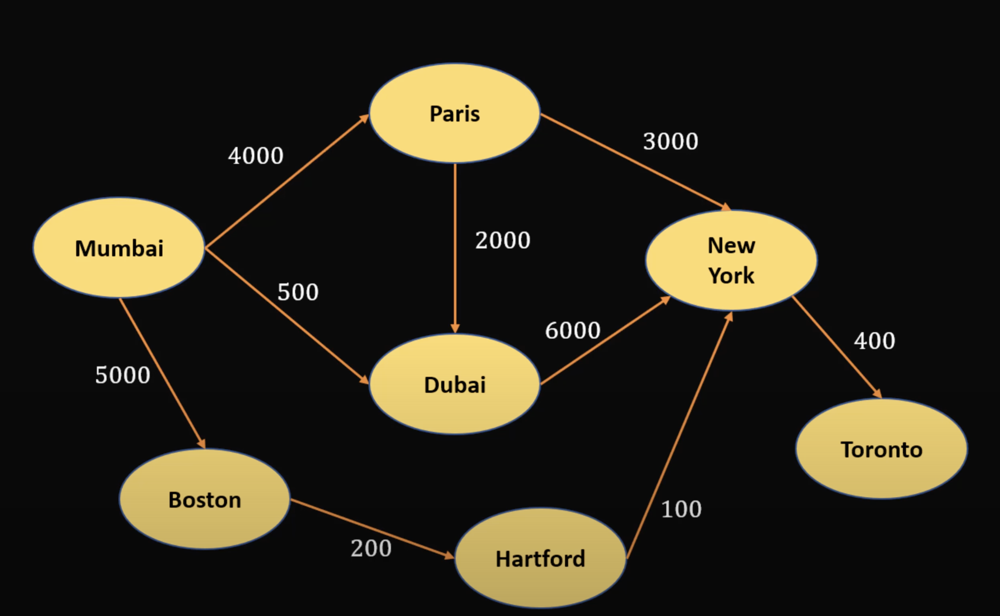

## Graph
---
### Types of Graphs
- Undirected Graph -> No direction between two nodes
    - Example: Facebook friend network
    - Individual entities are called nodes
    - Edges connect nodes
- Directed Graph -> Direction between two nodes
    - Example: Flight Routes
### Difference between Tree and Graph Data Structures
- Tree - should be only one path between two nodes
    - **Thought of as a special type of Graph**
- Graph - could be more than one path to get between two nodes
    - Finding paths
        - 1) Find all paths
        - 2) Find shortest path (min stops)
    - **Weighted Graph** - *weighted edges*: 

        - Paths -> shortest path (by distance)