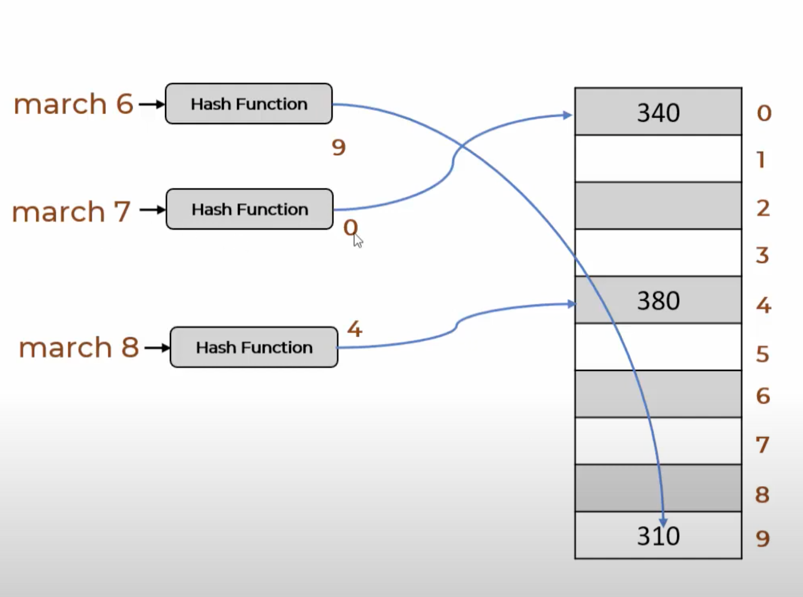
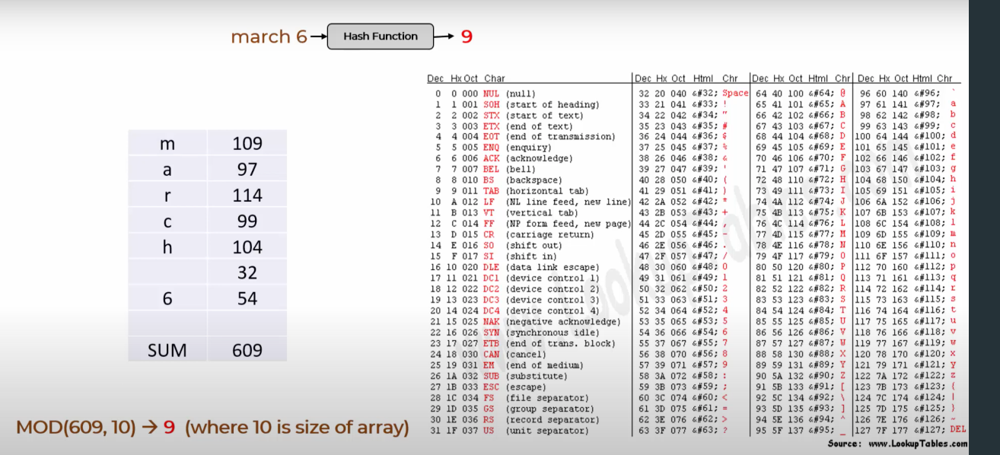
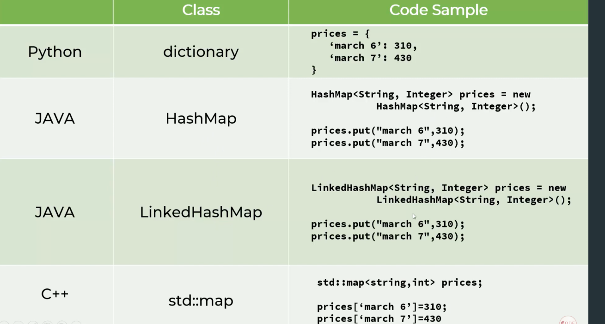

## Hash Tables or Hash Map
---
### Array vs Hash Map
- Array
    - stores the elements subsequently in the memory
    - usually uses integer indices
- Dictionary
    - Has a key that accesses the element in the memory
    - Uses a **hash function** to get the index of the element
        - Converting the string key into an index into an array 

    - usually uses string indices
- **Hash Map and Hash Table are basically the same thing**
    - Hash map and table are internal data structures
    - **Dictionaries are python specific implementation of hash tables**
---
### Hash Functions
- One way is to use ASCI values: 

- Examples of Hash Function in different languages: 

---
### Time Complexity for Hash map
- Look up by key: O(1) on average
- Insertion/Deletion: O(1) on average
