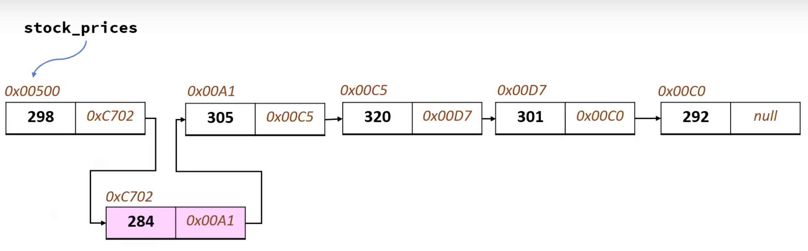
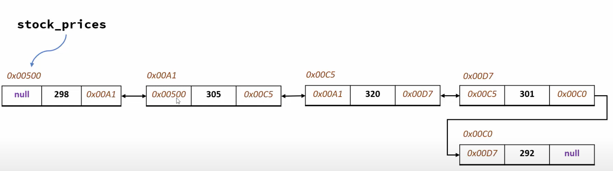
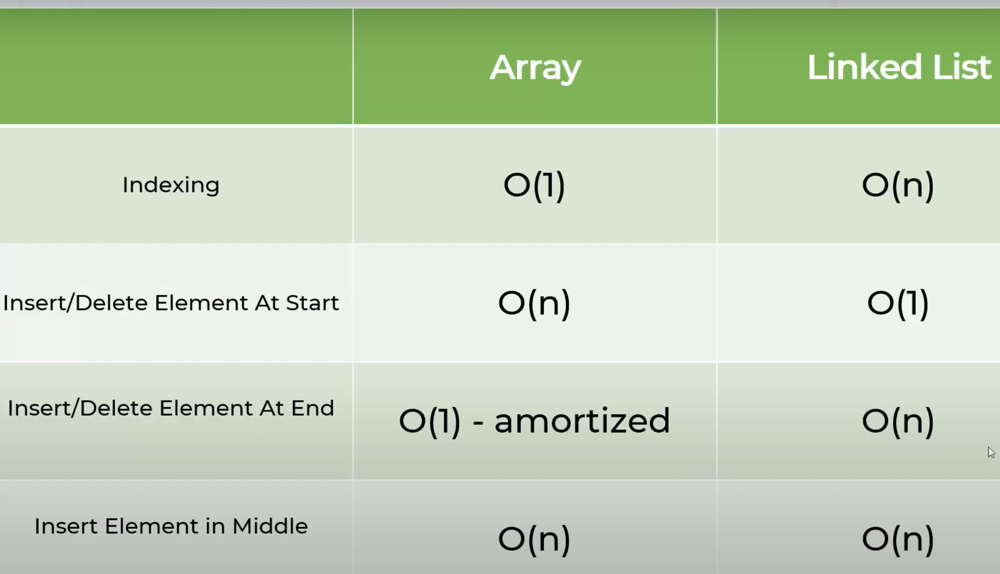

## Linked Lists
### Issues with Arrays that Linked Lists Solves
- Inserting elements in arrays then the arrays will swap all the indexes of elements
- Dynamic arrays allocate: allocated capacity = 5*2 = 10
    - Copies all old elements from old memory area to new memory area
- Arrays store memory in contiguous locations
### Linked Lists
- Values are at random memory locations, but are linked by pointers
- First element has a reference to next element
- Inserting elements means just modifying links: 

- Just changing the link of references
- BigO:
    - Insert element at beginning = O(1)
    - Delete element at beginning = O(1)
    - Insert/Delete element at the end = O(n)
- **Benefits Over Arrays**
    - **Do not need to pre-allocate space**
    - **Insertion is easier**
        - Linked List Traversal: O(n)
        - Accessing element by value = O(n)
### Double Linked List
- Not only have link to next element by **previous** element 

### BigO Analysis: Array vs. Linked List
- Comparison: 

- Only advantage of array is accessing element through indexing
- Amortized - if dynamic then have to copy for memory reallocation

