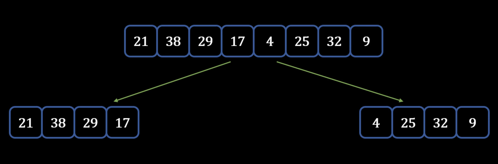
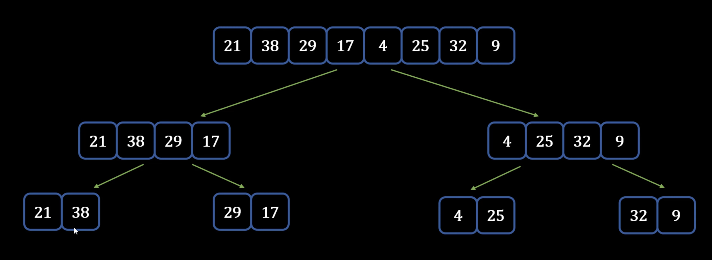
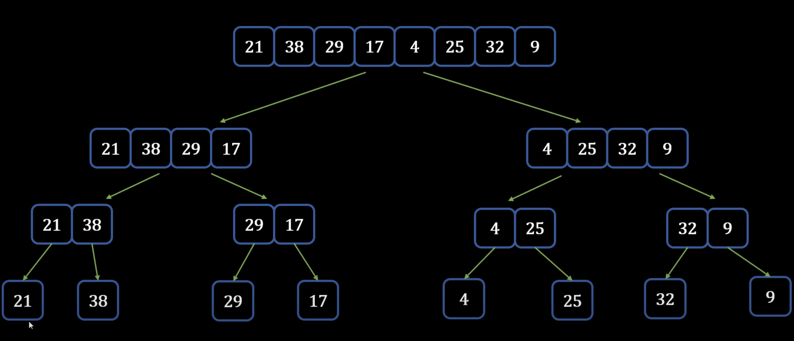
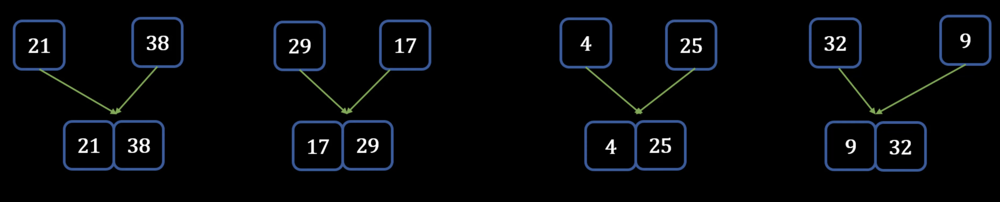
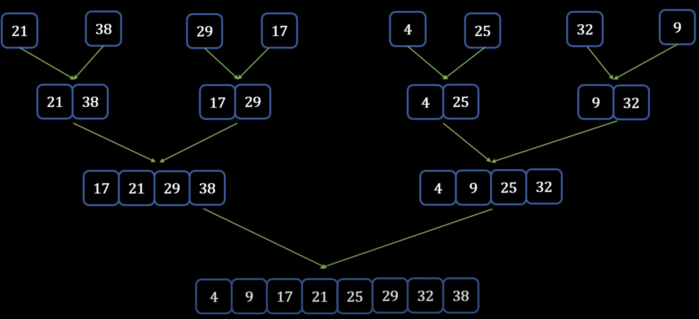

## Merge Sort
---
### Theory - How Merge Sort works
- Approach 1: **Using sorted arrays to merge into an empty array**
    - Take 2 sorted arrays -> want to merge arrays into 1 sorted array: <p align="center"></p>
    1) Start with first element of each array and compare them -> create a pointer at these elements
    2) The smaller element goes into empty list
    3) Move the pointer of the smaller element list to the next element
    4) Compare the pointer elements -> **add smaller one to sorted list**: <p align="center"></p>
    5) Repeat the above process until there is a single sorted array
- Approach 2: **Merge Sort on 1 Unsorted Array**
    1) Divide original array into 2 arrays: (4 and 4) or (5 and 4 if odd number of elements): <p align="center"></p>
    2) Divide these 2 arrays one more time -> because they are still not sorted: <p align="center"></p>
    3) Divide arrays again: <p align="center"></p>
        - **Array with single element is already sorted**
    4) Merge each of these arrays by using **Approach 1 technique**
        - Compare the values and create an array that is sorted: <p align="center"></p>
    5) *Keep merging until there is a single sorted array:* <p align="center"></p>
### Performance of Merge Sort
- Time Complexity: **O(n log n)**
    - Original divide operation is O(1) -> constant time
    - Combine step is O(n)
    - Merging and sorting is **O(n log n)**
- [Analysis of Merge Sort](https://www.khanacademy.org/computing/computer-science/algorithms/merge-sort/a/analysis-of-merge-sort)
- **```sort()``` built-in Python function uses Timsort**
    - *Timsort* - hybrid stable sorting algorithm that uses **merge sort and insertion sort**