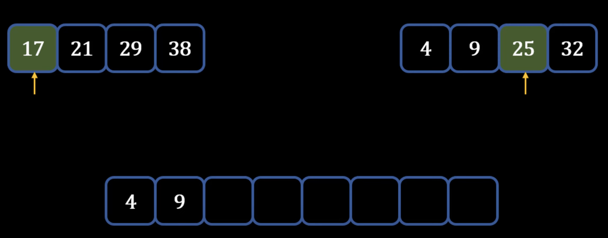

## Merge Sort
---
### Theory - How Merge Sort works
- Using a separate list: 

    1) Create a new list that is empty
    2) Start putting elements from unsorted list into new list
    3) Compare elements with elements in new list to **insert** at right place
- **Without using a separate list:** 

    1) Set a pointer on the second element
        - anything left of the pointer -> sorted
        - anything right of the pointer -> unsorted
    2) Put the element on the left side so that it is sorted
    3) *Move the pointer to the next element*
    4) **Compare pointer element with the elements of the left side**
    5) Repeat above process with rest of the elements until the rest of the elements are sorted
### Performance: Insertion Sort
- Worst-case Performance: **O(n^2) comparisons and swaps**
    - For unsorted, for n elements need to do n swaps -> n^2
- Best-case Performance: **O(n) comparisons and O(1) swaps**
    - Even if sorted, still have to do n comparisons but no swaps
- Average Performance: **O(n^2) comparisons and swaps**
- Worst-case space complexity: **O(n) total and O(1) auxiliary**
    - For space, might need to only create one variable to hold the anchor element