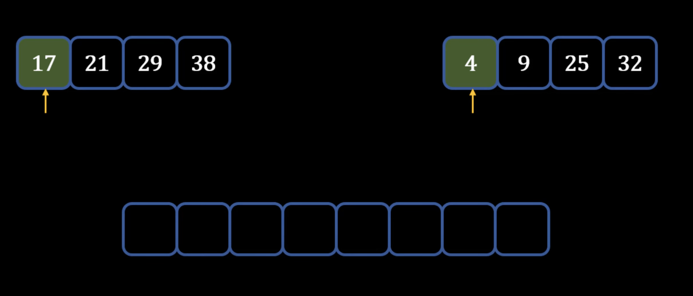

## Merge Sort
---
### Theory - How Merge Sort works
- Approach 1: **Using sorted arrays to merge into an empty array**
    - Take 2 sorted arrays -> want to merge arrays into 1 sorted array: 

    1) Start with first element of each array and compare them -> create a pointer at these elements
    2) The smaller element goes into empty list
    3) Move the pointer of the smaller element list to the next element
    4) Compare the pointer elements -> **add smaller one to sorted list**: 

    5) Repeat the above process until there is a single sorted array
- Approach 2: **Merge Sort on 1 Unsorted Array**
    1) 
### Performance: Insertion Sort
- Worst-case Performance: **O(n^2) comparisons and swaps**
    - For unsorted, for n elements need to do n swaps -> n^2
- Best-case Performance: **O(n) comparisons and O(1) swaps**
    - Even if sorted, still have to do n comparisons but no swaps
- Average Performance: **O(n^2) comparisons and swaps**
- Worst-case space complexity: **O(n) total and O(1) auxiliary**
    - For space, might need to only create one variable to hold the anchor element