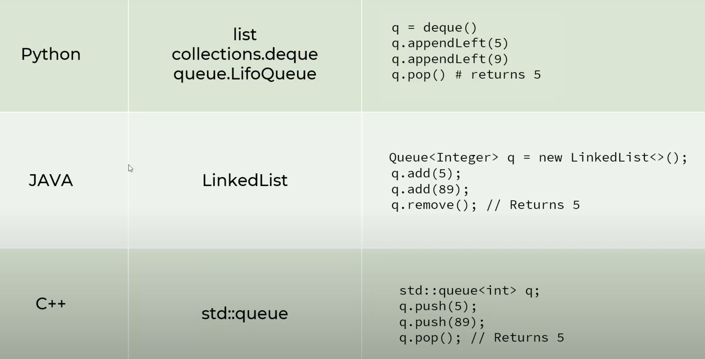

## Queue
---
### Example: Stock Price Exchange Without Queue
- Issue #1: What if HTTP server is down -> Loss of messages
- Issue #2: Managing multiple consumers becomes problematic
- **Queue establishes loose coupling**
    - Also called Producer-Consumer problem
        - One entity is producing information and another entity is consuming the information in away that they are not tightly coupled
### FIFO
- First in First Out
    - Example: Person standing in line for movie tickets
### Stack Implementation in Different Languages: 

