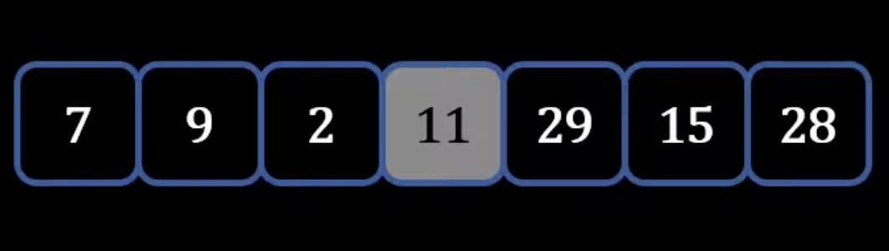
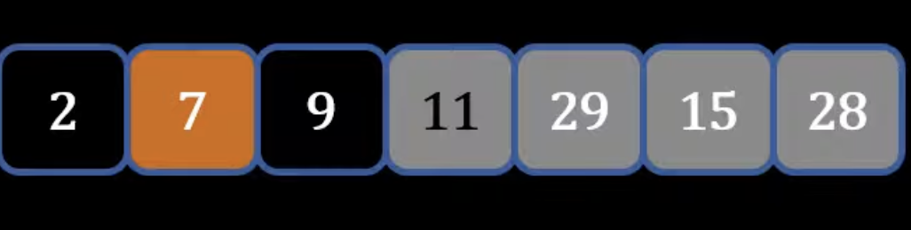
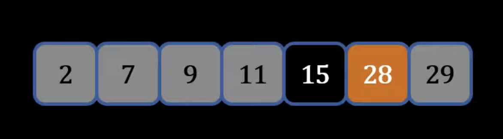
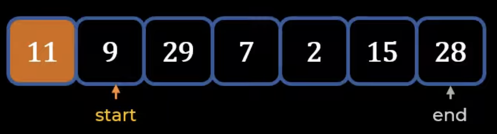
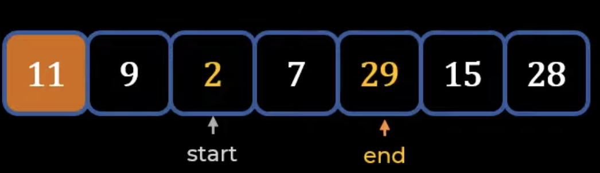
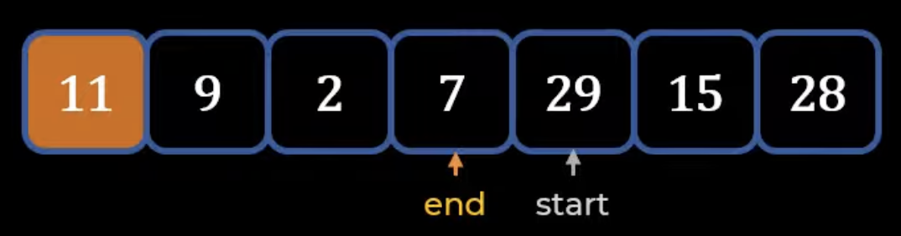
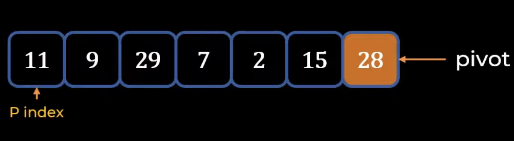
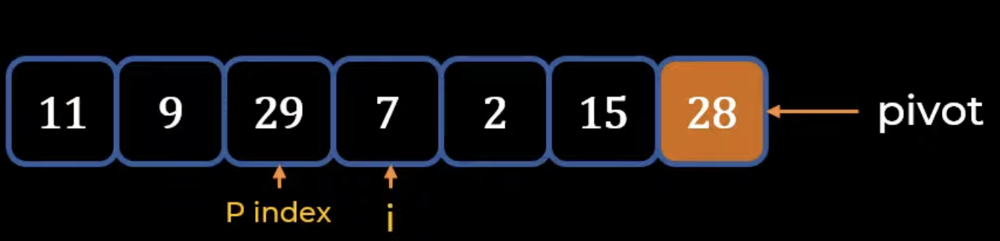
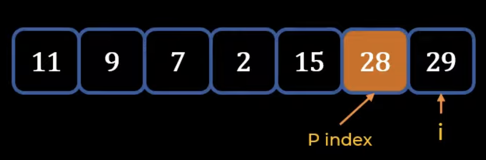

## Quick Sort
---
### Quick Sort Technique
1) Take a pivot (a number), put pivot in the right position, where left side less than pivot and right side greater than pivot: <p align="center"></p>
2) Pick the pivot of one side and repeat step above with that side: <p align="center"></p>
3) Find the pivot of the final side and repeat first step: <p align="center"></p>
- *Partitioning* - process of putting a pivot in its right position
### **Two Types of Partition Schemes: Hoare Partition and Lomuto Partition**
- **<mark>Hoare Partition:</mark>**
    - **Partitioning process**:
        1) Pivot is the leftmost element
        2) Have a Start and End Pointer: <p align="left"></p>
        3) Focus on start pointer -> *move start pointer until found element greater than pivot*
        4) Then focus on end pointer -> *reduce end pointer until element less than pivot*
        5) Swap start and end elements: <p align="left"></p>
        6) Repeat process from step 2 of choosing start and end pointer
        7) *Stop the process whenever end pointer crosses start pointer*: <p align="left"></p>
            - If pointers cross -> *swap end and pivot*
    - Repeat above process for left and right side
- **<mark>Lomuto Partition:</mark>**
    - **Partitioning process**:
        1) Pivot is the end element
        2) The starting element is called the ```p index``` or ```Partition Index```: <p align="left"></p>
        3) Keep moving p index -> *until element found that is greater than pivot*
        4) Start another counter ```i```
            - initially it is same p index
            - keeps moving until element found that is less than pivot: <p align="left"></p>
        5) *Swap the ```i ```counter element and the ```p index``` element*: <p align="left"></p>
        6) **Repeat the process of moving first the ```p index``` greater than pivot, then moving ```i``` counter for less than pivot, and swapping the two values:** <p align="left"></p>
    - All the elements left of p index less than and all on right side are greater than
### Time Complexity
- Average Time Complexity: **O(n log n)**
- Worst case time complexity: **O(n^2)**
    - wherever list is already sorted
    - creating an imbalanced partition
    - have n elements and are doing n iterations 
