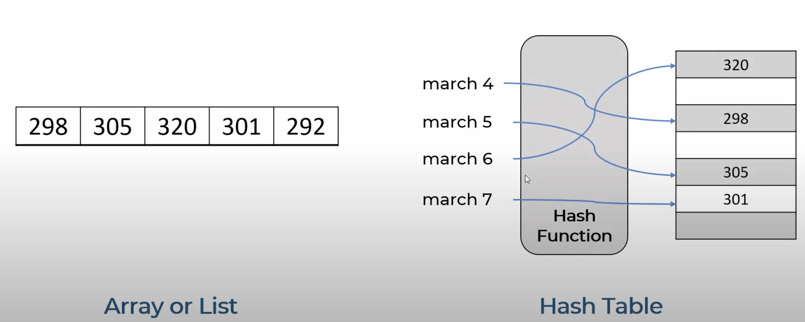
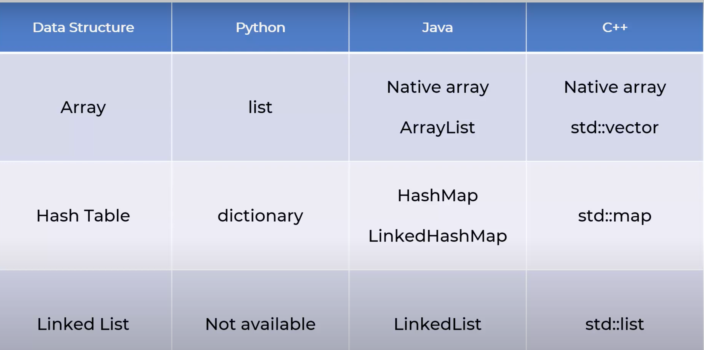

# Data Structures and Algorithms in Python

## Why need Data Structures?
- Raw building blocks
    - array, linked lists, trees...
- Definition: Building blocks or raw materials for any software programs
- **Use right data structure for a problem**
- Data Structures - containers storing data in a specific memory layout
- **Array vs Dictionary (Hash Map) Memory Visual:** 

    - Dictionary uses Hash Map
        - There is a key that gives and address of a bucket, which gives access to an element
- **Data Structures in different languages:** 

## Data Structures and Algorithms Topics Covered:
### - Time Complexity
### - Arrays
### - Linked List
### - Hash Table
### - Collision Handling in Hash Table
### - Stack
### - Queue
### - Tree (General Tree)
### - Binary Search Tree
### - Graph
### - Binary Search
### - Bubble Sort
### - Quick Sort
### - Insertion Sort
### - Merge Sort
### - Shell Sort
### - Selection Sort
### - Recursion