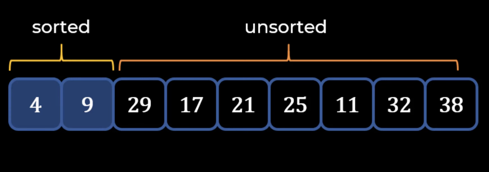
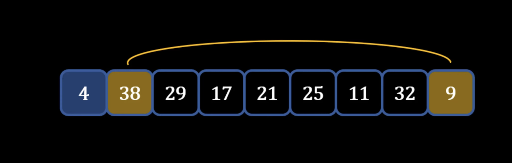

## Selection Sort
---
### Theory - How Selection Sort works
1) Take a list of numbers
2) Find the element that first the first position (find the minimum number)
3) Swap the minimum element with the first element
4) Move to the second element and find the element that first the position (left side of pointer is sorted): 

5) Repeat the above process for all elements until list sorted: 

## Summary
1) Start with **Gap = n/2** and sort sub-arrays
2) Keep reducing Gap by n/2 and keep on sorting sub-arrays
3) Last iteration should have Gap = 1 -> Becomes Insertion Sort
### Performance of Shell Sort
- Big O Complexity: O(n^2)
    - Two for loops in the program
    - Simple technique