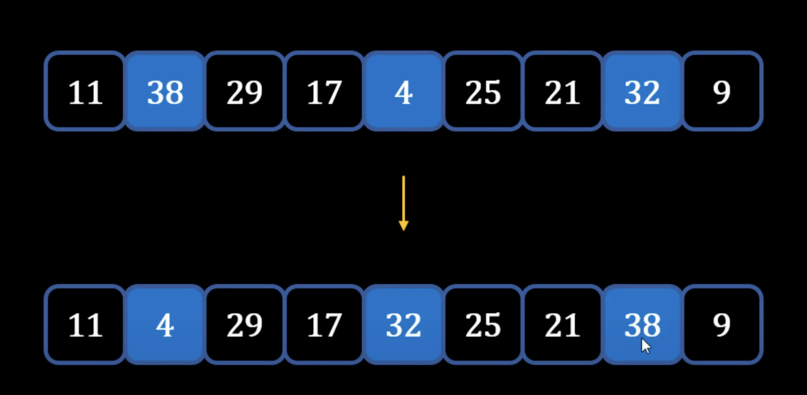

## Shell Sort
---
### Theory - How Shell Sort works
- Shell sort - **Optimization over Insertion Sort**
- Start with Insertion Sort process:
    1) Start with pointer at the second element (first element is sorted, so right side of pointer is unsorted) <p align="center"></p>
    2) Repeat the process of moving pointer and inserting element at right position
- **Problem with Insertion Sort**
    - When small elements are towards the end it takes many **comparisons and swaps** 
- **How Shell Sort Solves this Problem: Moves heavier or larger elements towards the end**
    1) Start with a Gap and form an sub-array using the gap: <p align="center"></p>
    2) Sort that sub-array made due to the Gap: <p align="center"></p>
    3) Create a new sub-array with the same Gap number and sort that sub-array: <p align="center"></p>
    4) **Repeat step 3 again until all the heavier or larger elements are more towards the right side:** <p align="center"></p>
    5) From a Gap of 3 -> move to Gap of 2 **(end goal is to reach a gap of 1)**
        - Every alternate element
    6) Sort that sub-array made from Gap of 2
    7) Create a new sub-array from the same Gap of 2 and sort it: <p align="center"></p>
    8) **Last step: Reduce the Gap to 1 -> Process becomes Insertion Sort**
    9) *Apply Insertion Sort and now swaps are reduced*
## Summary
1) Start with **Gap = n/2** and sort sub-arrays
2) Keep reducing Gap by n/2 and keep on sorting sub-arrays
3) Last iteration should have Gap = 1 -> Becomes Insertion Sort
### Performance of Shell Sort
- Worst-case performance: 
    - **O(n^2)**
        - Worst known worst case gap sequence
    - **O(n log^2 n)**
        - Best known worst case gap sequence
- Best-case performance:
    - **O(n log n)**
        - Most gap sequences
    - **O(n log^2 n)**
        - Best known worst-case gap sequence
- [Analysis of Merge Sort](https://www.khanacademy.org/computing/computer-science/algorithms/merge-sort/a/analysis-of-merge-sort)
- **```sort()``` built-in Python function uses Timsort**
    - *Timsort* - hybrid stable sorting algorithm that uses **merge sort and insertion sort**