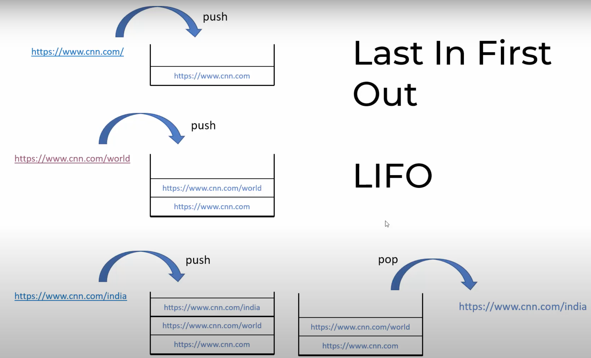

## Stack
---
### Problems with Array and Linked List
- Dynamic arrays have memory re-allocation problems
- To use linked list you need to traverse the entire list to get to the end
### Operations in Stack (Last in First Out Data Structure)
- Using Last in First Out (LIFO) method: 

- Keep **pushing** the elements into the data structure
- To go back  you retrieve the element you pushed using **pop**
    - Pop out the last element
